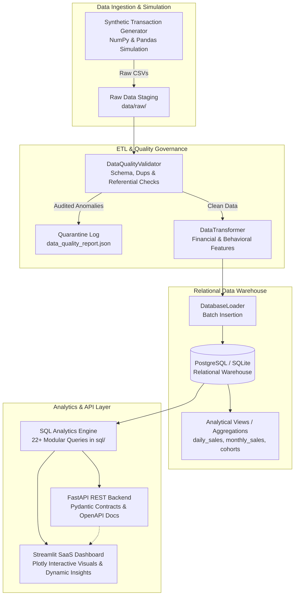

# RetailPulse — E-Commerce Analytics Platform

[](https://www.python.org/)
[](https://fastapi.tiangolo.com/)
[](https://streamlit.io/)
[](https://www.postgresql.org/)
[](https://www.docker.com/)
[](https://pytest.org/)

RetailPulse is a production-grade, full-stack Data Analytics & Data Engineering portfolio platform built for modern e-commerce intelligence. It features an end-to-end data lifecycle: synthetic transaction simulation (105,000+ orders, 22,000+ customers, 550+ SKUs), an automated modular ETL pipeline with schema validation and data quality anomaly isolation, a normalized PostgreSQL relational data warehouse with pre-aggregated analytical views, a 22-query SQL analytics library, a high-performance FastAPI REST API, and an executive Streamlit SaaS dashboard featuring dynamic, data-driven narrative insights.

---

## 🔗 Live Access & Cloud Links

* **Live Dashboard**: [https://retailpulse-analytics.streamlit.app](https://retailpulse-analytics.streamlit.app) *(Deploy via Streamlit Community Cloud in 1 click)*
* **Interactive API Documentation (Swagger)**: `https://<your-render-url>.onrender.com/docs` or `http://localhost:8000/docs`
* **Health Endpoint**: `http://localhost:8000/health`

---

## 1. Business Problem & Objective

Modern e-commerce enterprises generate millions of fragmented customer touchpoints, orders, line items, and returns. Without centralized data governance, unified data models, and automated analytics, leadership suffers from:
1. **Siloed Visibility**: Inability to connect marketing channel spend with downstream customer lifetime value (CLV) and repeat purchase velocity.
2. **Margin Degradation**: Invisible profit leakage caused by aggressive discounting, product return rates, and high cost-of-goods-sold (COGS).
3. **Data Quality Drift**: Ingestion of dirty, duplicated, or corrupted data corrupting business reporting.

**RetailPulse** solves these challenges by providing a battle-tested data platform that ingests, cleans, warehouses, queries, and visualizes retail transactions at scale.

---

## 2. Business Questions Answered

* **Revenue & Growth**: What is our true net revenue, and which months, regions, and categories drive peak trading? How does promotional discounting impact gross margin?
* **Customer Lifetime Value (CLV)**: Which acquisition channels deliver customers with the highest long-term retention and repeat purchase rate?
* **Customer Retention & Cohorts**: What percentage of acquired customers return in Month 1, Month 3, and Month 12? What does our behavioral RFM customer distribution look like?
* **Catalog Rationalization**: Which are the top 20 profit-generating SKUs, and which bottom 20 items should be marked down or removed due to low velocity?
* **Return Economics**: What is our global return rate, which product categories experience the highest return volume, and what are the primary root causes of refund value loss?

---

## 3. Architecture & Data Flow



---

## 4. Technology Stack

| Layer | Technology | Purpose & Justification |
| :--- | :--- | :--- |
| **Language** | Python 3.12+ | Core programming runtime across data generation, ETL, API, and UI |
| **Data Processing** | Pandas, NumPy | High-performance vectorized generation, cleaning, and transformation |
| **Database & ORM** | PostgreSQL 16, SQLAlchemy 2.0, Psycopg2 | Enterprise relational database with automated SQLite local development fallback |
| **Backend REST API** | FastAPI, Uvicorn, Pydantic v2 | Low-latency asynchronous REST API with automatic OpenAPI / Swagger documentation |
| **Dashboard UI** | Streamlit, Plotly Express & Graph Objects | Modern SaaS analytics interface with custom CSS and interactive visualizations |
| **Testing** | Pytest, TestClient | Automated unit and integration testing across validation, ETL, DB, and API |
| **DevOps & Containers** | Docker, Docker Compose, Git | Multi-container local/cloud orchestration and version control |

---

## 5. Repository Structure

```
RetailPulse/
├── app/
│   ├── api/
│   │   ├── __init__.py
│   │   ├── main.py              # FastAPI app initialization, CORS, lifespan
│   │   ├── routes.py            # REST endpoints with query parameter filters
│   │   └── schemas.py           # Pydantic v2 response contracts & input validation
│   └── dashboard/
│       ├── __init__.py
│       ├── app.py               # Streamlit master application & sidebar navigation
│       └── components/
│           ├── __init__.py
│           ├── styles.py        # Custom CSS, dark theme & card typography
│           ├── kpi_cards.py     # HTML metric cards with delta indicators
│           ├── charts.py        # Standardized Plotly chart builders
│           └── insights.py      # Dynamic, data-driven narrative insights engine
├── src/
│   ├── ingestion/
│   │   ├── __init__.py
│   │   └── synthetic_generator.py # 105k+ orders generator with realistic seasonality
│   ├── validation/
│   │   ├── __init__.py
│   │   └── data_quality.py      # Schema auditor, deduplicator & anomaly quarantine
│   ├── transformation/
│   │   ├── __init__.py
│   │   └── cleaner.py           # Derived metrics (profit, margins, tenure, totals)
│   ├── database/
│   │   ├── __init__.py
│   │   ├── connection.py        # SQLAlchemy engine, session pool & health probe
│   │   ├── models.py            # Declarative ORM relational models
│   │   ├── schema.sql           # PostgreSQL DDL table definitions & indexes
│   │   ├── views.sql            # Materialized analytical views
│   │   └── loader.py            # High-performance batch data ingestion
│   ├── analytics/
│   │   ├── __init__.py
│   │   └── query_runner.py      # SQL analytics executor & filter engine
│   └── utils/
│       ├── __init__.py
│       ├── config.py            # Environment variable manager & paths
│       └── logger.py            # Structured logging utility
├── sql/                         # 22+ Advanced Production SQL Queries
│   ├── kpis/                    # Total revenue, AOV, order status, unique customers, profit
│   ├── revenue/                 # Monthly revenue, MoM growth, YoY, best months, regional, category, discounts
│   ├── customer/                # New vs returning, acquisition channels, CLV tiers, repeat rate, RFM
│   ├── product/                 # Top products, bottom products, category margin drilldown
│   ├── retention/               # Customer retention rate, category return rate
│   └── cohorts/                 # Monthly cohort retention matrix
├── data/
│   ├── raw/                     # Generated raw CSVs
│   ├── processed/               # Transformed CSVs & data_quality_report.json
│   └── generated/
├── tests/                       # Automated Pytest Suite
│   ├── test_validation.py       # Data quality & quarantine test cases
│   ├── test_etl.py              # Transformation & derived calculation tests
│   ├── test_database.py         # Database connectivity & view tests
│   ├── test_analytics.py        # SQL query execution & calculation tests
│   └── test_api.py              # FastAPI REST endpoints integration tests
├── docs/
│   ├── architecture.md          # In-depth architectural blueprint & ERD
│   └── deployment_guide.md      # Cloud deployment guide (Streamlit Cloud, Render, Neon)
├── .streamlit/
│   └── config.toml              # Streamlit theme configuration (Dark Slate)
├── Dockerfile                   # Multi-stage production container build
├── docker-compose.yml           # 3-tier container stack (PostgreSQL + API + Dashboard)
├── render.yaml                  # Render cloud blueprint
├── Procfile                     # PaaS process configuration
├── requirements.txt             # Python dependencies
├── .env.example                 # Environment configuration template
├── .gitignore                   # Git exclusion rules
├── run_pipeline.py              # Master ETL orchestration entrypoint
└── README.md                    # Project documentation
```

---

## 6. Data Pipeline & Data Quality Engine

The ETL pipeline is executed via a single command:
```bash
python run_pipeline.py
```

### Execution Flow:
1. **Ingestion (`src/ingestion/`)**: Generates 105,000+ orders, 22,000+ customers, 550+ products, 167,000+ order line items, 105,000+ payment transactions, and 14,000+ returns over 2.5 years (2023–2025).
2. **Quality Audit & Validation (`src/validation/`)**:
   - Isolates duplicate primary keys and logs removed duplicates.
   - Detects and imputes missing customer emails using fallback guest identifiers.
   - Validates relational foreign keys, ensuring zero orphan order items or payments.
   - Quarantines negative prices, negative quantities, or invalid timestamps.
   - Generates an executive data governance audit: `data/processed/data_quality_report.json`.
3. **Transformation (`src/transformation/`)**:
   - Derives line-item `gross_amount`, `net_amount`, `product_cost`, and `profit`.
   - Aggregates order-level item counts, basket totals, and estimated gross margin.
4. **Relational Database Migration & Loading (`src/database/`)**:
   - Executes DDL creating tables, primary keys, foreign keys, and indexes.
   - Ingests cleaned data in optimized chunks.
   - Compiles pre-aggregated analytical views.

### Actual Pipeline Execution Summary:
```
=================================================================
         RETAILPULSE ETL EXECUTION SUMMARY REPORT        
=================================================================
Status:                      SUCCESS
Execution Duration:          31.95 seconds
Total Records Processed:     415,335
Duplicates Removed:          295
Invalid Rows Quarantined:    25
Final Clean Records Loaded:  415,015
-----------------------------------------------------------------
TABLE-BY-TABLE BREAKDOWN:
  • customers     : Raw=22,044  | Dups=44  | Quarantine=0  | Clean=22,000
  • products      : Raw=550     | Dups=0   | Quarantine=0  | Clean=550
  • orders        : Raw=105,000 | Dups=0   | Quarantine=0  | Clean=105,000
  • order_items   : Raw=167,958 | Dups=251 | Quarantine=25 | Clean=167,682
  • payments      : Raw=105,000 | Dups=0   | Quarantine=0  | Clean=105,000
  • returns       : Raw=14,783  | Dups=0   | Quarantine=0  | Clean=14,783
-----------------------------------------------------------------
DATA WAREHOUSE ROW VERIFICATION:
  • customers             : 22,000 records
  • products              : 550 records
  • orders                : 105,000 records
  • order_items           : 167,682 records
  • payments              : 105,000 records
  • returns               : 14,783 records
  • daily_sales           : 910 records
  • monthly_sales         : 30 records
  • customer_metrics      : 22,000 records
  • product_performance   : 550 records
  • category_performance  : 6 records
  • regional_performance  : 5 records
  • retention_metrics     : 6 records
  • cohort_analysis       : 465 records
  • return_metrics        : 6 records
=================================================================
```

---

## 7. Relational Database Schema & Views

### Core Tables:
* `customers`: `customer_id` (PK), `name`, `email`, `signup_date`, `country`, `region`, `acquisition_channel`.
* `products`: `product_id` (PK), `product_name`, `category`, `subcategory`, `price`, `cost`, `launch_date`.
* `orders`: `order_id` (PK), `customer_id` (FK), `order_date`, `order_status`, `shipping_region`, `payment_method`, `discount`, `total_amount`, `total_items`, `unique_products`, `estimated_profit`.
* `order_items`: `order_item_id` (PK), `order_id` (FK), `product_id` (FK), `quantity`, `unit_price`, `discount`, `product_cost`, `gross_amount`, `net_amount`, `total_cost`, `profit`.
* `payments`: `payment_id` (PK), `order_id` (FK), `payment_date`, `payment_method`, `payment_status`, `payment_amount`.
* `returns`: `return_id` (PK), `order_id` (FK), `product_id` (FK), `return_date`, `return_reason`, `refund_amount`.

### Pre-Aggregated Analytical Views:
* `daily_sales`: Daily order volume, customers, gross & net revenue, AOV, and profit.
* `monthly_sales`: Monthly revenue trajectories and customer counts.
* `customer_metrics`: Customer RFM baseline, total lifetime spend, orders, and order span.
* `product_performance`: Aggregated SKU sales volume, revenue, profit, margin %, and returns.
* `category_performance`: Category-level market share, unit volume, and return exposure.
* `regional_performance`: Geographic breakdown of revenue, orders, and AOV.
* `retention_metrics`: Repeat purchase rate and average CLV segmented by acquisition channel.
* `cohort_analysis`: Month 0 to Month 12+ retention matrix base.
* `return_metrics`: Root cause analysis of returns and total refund capital loss.

---

## 8. SQL Analytics Library (22+ Modular Queries)

All queries are organized under `sql/` and utilize Common Table Expressions (CTEs), window functions (`LAG`, `ROW_NUMBER`, `DENSE_RANK`, `NTILE`, `SUM() OVER()`), and conditional aggregations:

1. `sql/kpis/total_revenue.sql`: Calculates total gross and net revenue, deductions, and global AOV.
2. `sql/revenue/monthly_revenue.sql`: Monthly revenue trajectory and transacting customers.
3. `sql/revenue/monthly_growth_rate.sql`: Month-over-Month (MoM) revenue and order growth rate using `LAG()`.
4. `sql/kpis/average_order_value.sql`: AOV distribution, average basket size, and revenue per unit.
5. `sql/kpis/total_orders.sql`: Fulfillment efficiency and order status distribution.
6. `sql/kpis/unique_customers.sql`: Unique customer activity penetration and repeat buyer share.
7. `sql/customer/new_vs_returning_customers.sql`: Classifies new vs repeat orders using `ROW_NUMBER()`.
8. `sql/product/top_products.sql`: Top 20 revenue-generating products using `DENSE_RANK()`.
9. `sql/product/bottom_products.sql`: Bottom 20 underperforming SKUs for inventory clearance.
10. `sql/product/top_categories.sql`: Category and subcategory drilldown with margin metrics.
11. `sql/revenue/revenue_by_region.sql`: Regional revenue contribution, AOV, and share of global revenue.
12. `sql/kpis/profit_estimation.sql`: Combines product costs, discounts, and order item margins.
13. `sql/revenue/discount_impact.sql`: Promotional discount tiers (0%, 1-5%, 6-15%, >15%) and price elasticity.
14. `sql/retention/return_rate.sql`: Category return rate % and refund value loss %.
15. `sql/customer/customer_lifetime_value.sql`: Segments customers into VIP, High, Mid, and Standard value tiers.
16. `sql/customer/repeat_purchase_rate.sql`: Frequency buckets (1 order, 2 orders, 3-5 orders, 6+ orders).
17. `sql/retention/customer_retention.sql`: Repurchase velocity and retention ratios.
18. `sql/cohorts/cohort_retention_matrix.sql`: Triangular cohort retention matrix across Month 0 to Month 12+.
19. `sql/revenue/revenue_contribution_by_category.sql`: Category sales share and Pareto concentration.
20. `sql/revenue/yoy_growth.sql`: Year-over-Year revenue comparison across consecutive years.
21. `sql/revenue/best_performing_months.sql`: Ranked peak months using `DENSE_RANK()`.
22. `sql/customer/acquisition_channel_performance.sql`: CAC proxy, average CLV, and repeat rate by acquisition source.

---

## 9. FastAPI REST API

The backend exposes analytical endpoints with Pydantic v2 schemas and Swagger documentation at `/docs`:

| Endpoint | Method | Description | Supported Parameters |
| :--- | :---: | :--- | :--- |
| `/health` | `GET` | System health probe and database connection status | None |
| `/api/summary` | `GET` | High-level executive KPIs (Revenue, Orders, AOV, Profit, Returns) | `start_date`, `end_date`, `region`, `category` |
| `/api/sales` | `GET` | Time-series sales trajectories (Daily or Monthly) | `granularity`, `start_date`, `end_date`, `region`, `category` |
| `/api/products` | `GET` | Ranked product catalog performance | `limit`, `category`, `ascending` |
| `/api/categories` | `GET` | Category sales volume, revenue, and gross margins | `start_date`, `end_date`, `region` |
| `/api/customers` | `GET` | Customer profiles, lifetime spend, and order frequency | `limit`, `region`, `channel` |
| `/api/regions` | `GET` | Geographic performance metrics and AOV | `start_date`, `end_date`, `category` |
| `/api/retention` | `GET` | Customer repurchase velocity and retention ratios | None |
| `/api/cohorts` | `GET` | Triangular monthly cohort retention matrix | None |
| `/api/orders` | `GET` | Recent transactional order records | `limit`, `status`, `region` |
| `/api/quality` | `GET` | ETL data quality audit and anomaly quarantine report | None |

---

## 10. Streamlit SaaS Analytics Dashboard

The frontend is styled like a modern SaaS analytics product with custom typography, responsive metric cards, dark slate aesthetic, and interactive Plotly visuals.

### Dashboard Modules:
1. **🏢 Executive Overview**: Top-level KPI cards (Net Revenue, Total Orders, AOV, Estimated Profit, Return Rate), dual-axis trajectory chart, category donut breakdown, regional bar charts, and top SKUs.
2. **📈 Sales Analytics**: Monthly/Daily revenue velocity, order volume, MoM growth rates, and CSV export.
3. **👥 Customer Analytics**: Acquisition channel efficiency, CLV tier distributions, RFM behavioral segmentation (Champions, Loyal, At Risk, Hibernating), and new vs returning buyers.
4. **📦 Product Analytics**: Top 10 best-selling SKUs, bottom 10 clearance items, and subcategory margin drilldowns.
5. **🔄 Cohort Analysis**: Interactive Viridis heatmap displaying customer retention rates across Month 0 to Month 12+.
6. **🌍 Regional Analytics**: Geographic revenue contribution, regional AOV comparison, and market share.
7. **🔁 Returns Analytics**: Return rate gauge, refund loss breakdown, and primary return reasons.
8. **🛡️ Data Quality & Pipeline Health**: Live view of ETL records processed, cleaned, duplicates cleared, and quarantined anomalies.

### Automated Dynamic Business Insights Engine:
Rather than static text, RetailPulse automatically computes narrative takeaways dynamically from live query results:
* *"Monthly revenue increased by 18.4% from 2024-02 ($1.8M) to 2024-03 ($2.1M)."*
* *"Electronics is the largest product category, contributing 34.2% of gross revenue with an average margin of 41.5%."*
* *"North America leads in total transaction volume, while Europe commands the highest Average Order Value at $744.73."*
* *"Organic Search delivers the highest customer loyalty, with a repeat purchase rate of 74.1% and average CLV of $3,210.50."*

---

## 11. Local Installation & Setup

### Prerequisites
* Python 3.11+
* Git
* (Optional) Docker & Docker Compose

### Step 1: Clone Repository
```bash
git clone https://github.com/<YOUR-GITHUB-USERNAME>/RetailPulse.git
cd RetailPulse
```

### Step 2: Set Up Virtual Environment & Dependencies
```bash
python -m venv venv
# On Windows:
venv\Scripts\activate
# On macOS/Linux:
source venv/bin/activate

pip install -r requirements.txt
```

### Step 3: Run the ETL Pipeline
```bash
python run_pipeline.py
```
*Generates 105k+ orders, validates data quality, initializes database, loads tables, and builds analytical views.*

### Step 4: Run Automated Tests
```bash
python -m pytest tests/ -v
```

### Step 5: Launch Services
* **Start FastAPI REST API**:
  ```bash
  python -m uvicorn app.api.main:app --host 127.0.0.1 --port 8000 --reload
  ```
  *Swagger docs available at: `http://127.0.0.1:8000/docs`*

* **Start Streamlit Dashboard**:
  ```bash
  python -m streamlit run app/dashboard/app.py
  ```
  *Dashboard opens automatically in your browser at: `http://localhost:8501`*

---

## 12. Docker Deployment

To run the complete 3-tier containerized stack (PostgreSQL 16, FastAPI backend, and Streamlit frontend):

```bash
docker compose up -d
```

Verify service health:
```bash
docker compose ps
```

* Streamlit Dashboard: `http://localhost:8501`
* FastAPI Backend & Docs: `http://localhost:8000/docs`
* PostgreSQL Database: `localhost:5432`

---

## 13. Cloud Deployment (Free Tier)

For complete zero-friction cloud deployment instructions, see [docs/deployment_guide.md](docs/deployment_guide.md):
1. **Frontend**: Streamlit Community Cloud (Free, 1-click deployment from GitHub repo).
2. **Backend**: Render (Free-tier web service deployment using `render.yaml`).
3. **Database**: Neon Serverless PostgreSQL or Supabase (Free-tier managed database).

---

## 14. Interview Talking Points (Data Analyst & Analytics Engineer)

When discussing RetailPulse in a Data Analyst or Analytics Engineer interview:

1. **End-to-End Ownership**: "I designed and implemented the entire analytics lifecycle—from raw synthetic transaction generation with realistic seasonal patterns to automated ETL cleaning, relational data modeling, and an executive dashboard."
2. **Data Governance & Quality**: "Rather than assuming clean data, I built a dedicated validation engine that flags duplicate IDs, imputes missing values, ensures referential integrity, and isolates dirty records in a structured quarantine report."
3. **Advanced SQL Proficiency**: "I authored 22 production-grade SQL scripts utilizing CTEs, window functions (`LAG` for MoM growth, `DENSE_RANK` for product ranking, `NTILE` for RFM segmentation, and month difference offsets for cohort retention analysis)."
4. **Data Delivery & Product Mindset**: "I exposed analytical tables via a FastAPI REST service with Pydantic contracts and built a SaaS-grade Streamlit dashboard featuring automated narrative insight generation to directly answer executive business questions."

---

## 15. Future Roadmap

* [ ] Add automated dbt (data build tool) transformation models and documentation generation.
* [ ] Integrate Apache Airflow / Cloud Composer DAGs for scheduled daily incremental loads.
* [ ] Implement machine learning customer churn prediction and demand forecasting models.
* [ ] Add authentication and role-based access control (RBAC) for sensitive executive views.

---

## License

This project is licensed under the MIT License — see the [LICENSE](LICENSE) file for details.
