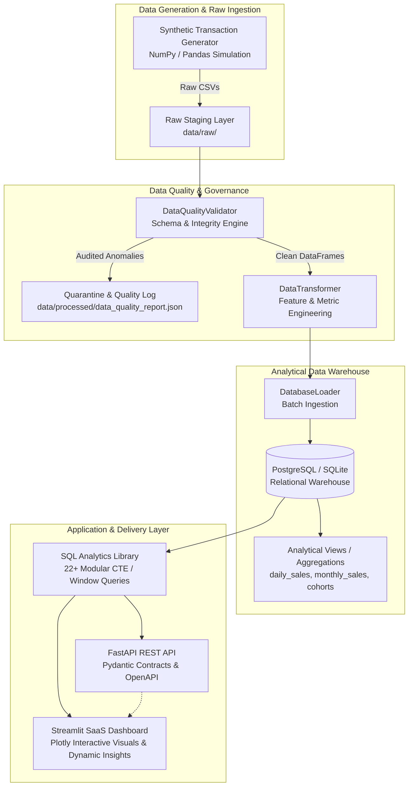
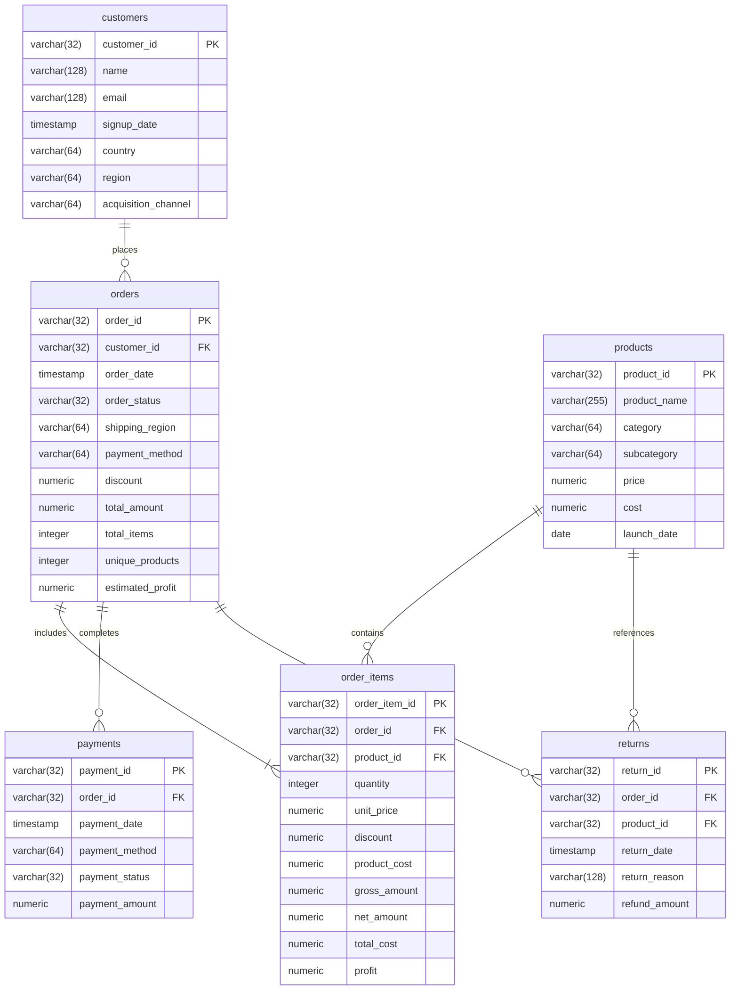

# RetailPulse — Architecture & Data Engineering Blueprint

This document details the end-to-end technical architecture, data pipeline mechanics, relational database schema, SQL analytics engine, and deployment topologies of **RetailPulse**.

---

## 1. System Architecture Overview

---

## 2. Relational Schema & Entity Relationship Diagram (ERD)

---

## 3. Data Pipeline & ETL Workflow

### Step 1: Ingestion & Realistic Simulation
- Generates 105,000+ orders, 22,000+ customers, 550+ products over 2.5 years.
- Incorporates realistic e-commerce mechanics:
  - **Pareto Spend Distribution**: 20% of customers drive 70% of repeat transactions.
  - **Holiday & Promo Seasonality**: Q4 spikes (Black Friday, Cyber Week) and mid-year sales surges.
  - **Category-Calibrated Returns**: Higher return rates in Apparel (~16%) versus Electronics (~7%) and Books (~2%).
  - **Controlled Dirty Data**: Injected edge cases (whitespace, duplicate IDs, missing emails, invalid prices) to stress-test data validation.

### Step 2: Data Quality & Governance Audit
- **Completeness**: Imputes or isolates missing critical fields.
- **Uniqueness**: Deduplicates records using primary keys with deterministic keep logic.
- **Relational Integrity**: Enforces referential integrity (prevents orphan order items and payments).
- **Domain Validity**: Quarantines negative prices, quantities, and invalid date anomalies.
- **Audit Logging**: Emits `data_quality_report.json` with execution counts.

### Step 3: Feature Engineering & Derived Financials
- Calculates line-item gross revenue, discount deductions, net revenue, total cost of goods sold (COGS), and net profit.
- Aggregates order-level item counts, basket size, and estimated profit.

### Step 4 & 5: Relational Warehouse Loading
- High-performance chunked batch loading into PostgreSQL / SQLite.
- Fully idempotent: drops and rebuilds schemas cleanly.

### Step 6: Analytical Views Compilation
- Pre-aggregates daily sales, monthly sales, customer lifetime metrics, product margins, regional penetration, and cohort retention.

---

## 4. SQL Analytics & Metric Framework

The `sql/` directory contains 22 specialized, production-ready SQL scripts organized into 6 domains:

1. **`sql/kpis/`**:
   - `total_revenue.sql`: Net revenue, discounts, gross volume, global AOV.
   - `average_order_value.sql`: Basket size, unit economics, price distribution.
   - `total_orders.sql`: Fulfillment efficiency and order status breakdown.
   - `unique_customers.sql`: Active penetration, repeat buyer share.
   - `profit_estimation.sql`: COGS, gross margins, promotional cost.
2. **`sql/revenue/`**:
   - `monthly_revenue.sql`: Monthly trajectory and active customers.
   - `monthly_growth_rate.sql`: Month-over-Month (MoM) growth using `LAG()`.
   - `yoy_growth.sql`: Year-over-Year comparison across consecutive years.
   - `best_performing_months.sql`: Ranked peak months using `DENSE_RANK()`.
   - `revenue_by_region.sql`: Regional revenue contribution and AOV.
   - `revenue_contribution_by_category.sql`: Category Pareto analysis.
   - `discount_impact.sql`: Discount tiers and margin elasticity.
3. **`sql/customer/`**:
   - `new_vs_returning_customers.sql`: First-time vs repeat classification using `ROW_NUMBER()`.
   - `acquisition_channel_performance.sql`: CAC proxy, average CLV, repeat rate by acquisition source.
   - `customer_lifetime_value.sql`: Value tier segmentation (VIP, High, Mid, Standard).
   - `repeat_purchase_rate.sql`: Order frequency distribution buckets.
   - `customer_segmentation_rfm.sql`: Recency, Frequency, Monetary segmentation using `NTILE(4)`.
4. **`sql/product/`**:
   - `top_products.sql`: Top 20 best-selling SKUs by gross revenue.
   - `bottom_products.sql`: Bottom 20 underperforming inventory SKUs for clearance.
   - `top_categories.sql`: Category and subcategory drilldown with margin metrics.
5. **`sql/retention/`**:
   - `customer_retention.sql`: Repurchase velocity and retention ratios.
   - `return_rate.sql`: Return rate and refund value loss by product category.
6. **`sql/cohorts/`**:
   - `cohort_retention_matrix.sql`: Triangular cohort retention matrix spanning Month 0 to Month 12+.
